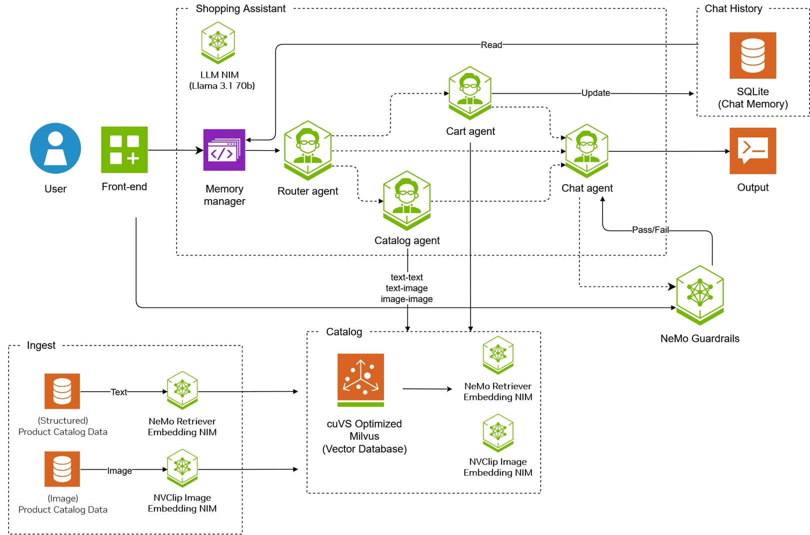

<a id="top"></a>
# 🛍️ NVIDIA AI Blueprint: Retail Shopping Assistant

<div align="center">


**AI-powered retail shopping assistant with multi-agent architecture**

[](LICENSE)
[](https://www.python.org/)
[](https://www.docker.com/)
[](https://github.com/NVIDIA-AI-Blueprints/retail-shopping-assistant/stargazers)
[](https://github.com/NVIDIA-AI-Blueprints/retail-shopping-assistant/issues)
[](https://github.com/NVIDIA-AI-Blueprints/retail-shopping-assistant/commits)
[](https://github.com/NVIDIA-AI-Blueprints/retail-shopping-assistant/graphs/contributors)

</div>

## 📋 Table of Contents

- [Overview](#overview)
  - [Key Features](#key-features)
  - [Architecture](#architecture)
- [Get Started](#get-started)
  - [Prerequisites](#prerequisites)
  - [Quick Start](#quick-start)
- [Documentation](#documentation)
- [Contribution Guidelines](#contribution-guidelines)
- [Community](#community)
- [References](#references)
- [License](#license)

## Overview

The Retail Shopping Assistant is an AI-powered blueprint that provides a comprehensive interface for an intelligent retail shopping advisor. Built with LangGraph for agent orchestration, it features multi-agent architecture, real-time streaming responses, image-based search, and intelligent shopping cart management.

### Key Features

- 🤖 **Intelligent Product Search**: Find products using natural language or images
- 🛒 **Smart Cart Management**: Add, remove, and manage shopping cart items
- 🖼️ **Visual Search**: Upload images to find similar products
- 💬 **Conversational AI**: Natural language interactions
- 🔒 **Content Safety**: Built-in moderation and safety checks
- ⚡ **Real-time Streaming**: Live response generation
- 📱 **Responsive UI**: Modern, mobile-friendly interface

### Architecture



The application follows a microservices architecture with specialized agents for different tasks:
- **Chain Server**: Main API with LangGraph orchestration
- **Catalog Retriever**: Product search and recommendations
- **Memory Retriever**: User context and cart management
- **Guardrails**: Content safety and moderation
- **UI**: React-based frontend interface

For detailed architecture information, see [Architecture Overview](docs/README.md#architecture-overview).

## Get Started

### Prerequisites

- **Docker**: Version 20.10+ with Docker Compose plugin
- **NVIDIA NGC Account**: For API access ([Get API Key](https://ngc.nvidia.com/))
- **Hardware**: 4x H100 GPUs (preferred) or 4x A100 GPUs (minimum) for local deployment, or cloud access

### Quick Start

1. **Clone the repository**:
   ```bash
   git clone https://github.com/NVIDIA-AI-Blueprints/retail-shopping-assistant.git
   cd retail-shopping-assistant
   ```

2. **Authenticate with NVIDIA Container Registry**:
   ```bash
   docker login nvcr.io
   ```
   Use `$oauthtoken` as the username and your NGC API key as the password.

3. **Set up environment**:
   ```bash
   export NGC_API_KEY=your_nvapi_key_here
   export LLM_API_KEY=$NGC_API_KEY
   export EMBED_API_KEY=$NGC_API_KEY
   export RAIL_API_KEY=$NGC_API_KEY
   export LOCAL_NIM_CACHE=~/.cache/nim
   mkdir -p "$LOCAL_NIM_CACHE"
   chmod a+w "$LOCAL_NIM_CACHE"
   ```

4. **Launch the application**:
   
   **Option A: Local Deployment**:
   ```bash
   # Start local NIMs (requires 4x H100 GPUs)
   docker compose -f docker-compose-nim-local.yaml up -d
   
   # Build and launch the application
   docker compose -f docker-compose.yaml up -d --build
   ```
   
   **Option B: Cloud Deployment** (no local GPUs required):
   ```bash
   # Configure to use NVIDIA API Catalog endpoints
   export CONFIG_OVERRIDE=config-build.yaml
   
   # Build and launch the application
   docker compose -f docker-compose.yaml up -d --build
   ```

5. **Access the application**: Open your browser to `http://localhost:3000`

6. **Stop the containers**:
   
   **Option A: Local Deployment**:
   ```bash
   docker compose -f docker-compose.yaml -f docker-compose-nim-local.yaml down
   ```
   
   **Option B: Cloud Deployment**:
   ```bash
   docker compose -f docker-compose.yaml down
   ```

For detailed installation instructions, see [Deployment Guide](docs/DEPLOYMENT.md).

## Deploy on NVIDIA Brev

For a streamlined cloud deployment experience, you can deploy the Retail Shopping Assistant on **NVIDIA Brev** using GPU Environment Templates (Launchables):

**[NVIDIA Brev Deployment Guide](docs/BREV.md)** - Complete step-by-step instructions for deploying on Brev

### Why Choose NVIDIA Brev?

- **One-Click Deployment**: Pre-configured GPU environments with automatic setup
- **Managed Infrastructure**: No need to manage servers or GPU clusters
- **Secure Access**: Built-in secure tunneling for web interface access  
- **Flexible Resources**: Choose from H100, A100, and other GPU configurations
- **Cost-Effective**: Pay only for actual usage time

The Brev deployment guide walks you through the entire process from creating a Launchable to accessing your fully functional retail shopping assistant.

## Documentation

- **[User Guide](docs/USER_GUIDE.md)**: How to use the application
- **[API Documentation](docs/API.md)**: Complete API reference
- **[Deployment Guide](docs/DEPLOYMENT.md)**: Installation and setup instructions
- **[Documentation Hub](docs/README.md)**: Complete documentation index

## Contribution Guidelines

We welcome contributions! Please see our [Contributing Guide](CONTRIBUTING.md) for details on:

- Development setup and environment configuration
- Coding standards and best practices
- Testing guidelines and examples
- Pull request process and code review guidelines

## Community

- **GitHub Issues**: [Report bugs and feature requests](https://github.com/NVIDIA-AI-Blueprints/retail-shopping-assistant/issues)
- **Documentation**: [Comprehensive guides and references](docs/README.md)

## References

### NVIDIA AI Blueprints
- [NVIDIA AI Blueprints](https://github.com/NVIDIA-AI-Blueprints): Collection of AI application blueprints
- [NVIDIA NIM](https://catalog.ngc.nvidia.com/orgs/nim): Containerized AI models
- [NVIDIA NGC](https://ngc.nvidia.com/): AI platform and container registry

### Technologies Used
- [LangGraph](https://github.com/langchain-ai/langgraph): Agent orchestration framework
- [FastAPI](https://fastapi.tiangolo.com/): Modern Python web framework
- [React](https://reactjs.org/): JavaScript library for building user interfaces
- [Milvus](https://milvus.io/): Vector database for similarity search

### Related Projects
- [NVIDIA Retrieval QA](https://catalog.ngc.nvidia.com/orgs/nim/teams/nvidia/containers/nv-embedqa-e5-v5): Embedding model for semantic search
- [NV-CLIP](https://catalog.ngc.nvidia.com/orgs/nim/teams/nvidia/containers/nvclip): Visual understanding model
- [Nemotron 3 Super](https://catalog.ngc.nvidia.com/orgs/nim/teams/nvidia/containers/nemotron-3-super-120b-a12b): Large language model

## License

GOVERNING TERMS: Use of the blueprint software and materials and NIM containers are governed by the [NVIDIA Software License Agreement](https://www.nvidia.com/en-us/agreements/enterprise-software/nvidia-software-license-agreement/) and [Product-specific Terms for AI products](https://www.nvidia.com/en-us/agreements/enterprise-software/product-specific-terms-for-ai-products/);  and the use of models is governed by the [NVIDIA Community Model License](https://www.nvidia.com/en-us/agreements/enterprise-software/nvidia-community-models-license/).
 
ADDITIONAL INFORMATION: [Llama 3.1 Community License Agreement](https://www.llama.com/llama3_1/license/) for Llama 3.1 70B Instruct NIM, Llama 3.1 NemoGuard 8B - Content Safety and Llama 3.1 NemoGuard 8B - Topic Control models, built with Llama, (ii) MIT license for NV-EmbedQA-E5-v5.
 
This project will download and install additional third-party open source software projects. Review the license terms of these open source projects before use, found in [License-3rd-party.txt](/LICENSE-3rd-party.txt).
 
Use of the product catalog data in the retail shopping assistant is governed by the terms of the [NVIDIA Data License for Retail Shopping Assistant](/LICENSE-assets.txt) (15Aug2025).

---

<div align="center">

[Back to Top](#top)

</div>


